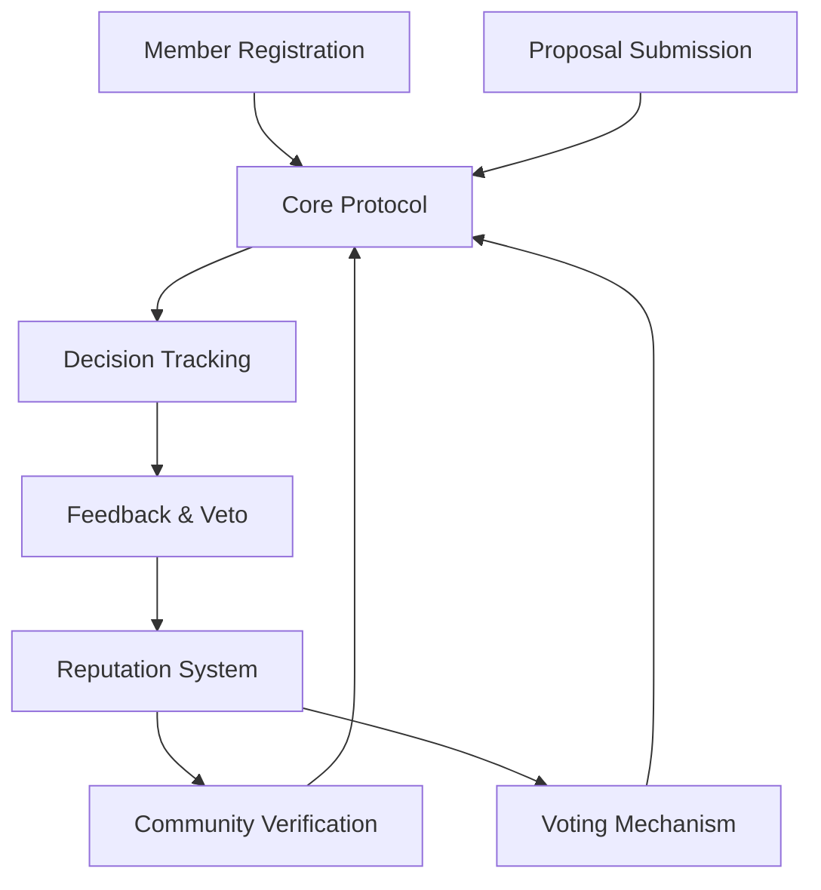

# Public Veto Detector

A decentralized protocol that enables transparent, community-driven decision tracking and collaborative governance.

## Overview

Public Veto creates a trustless, transparent mechanism for community decision-making by combining:
- Verified community member profiles
- Proposal submission and tracking
- Decentralized voting mechanisms
- Reputation and accountability systems

The protocol ensures fair, democratic processes by providing open participation, transparent voting, and verifiable accountability.

## Architecture

The protocol consists of several interconnected components:



### Core Components
- **Member Profiles**: Tracks community member identities and verification status
- **Proposal Management**: Enables proposal submission and lifecycle tracking
- **Voting Mechanism**: Implements fair, transparent voting processes
- **Reputation System**: Tracks member contributions and accountability
- **Veto Tracking**: Allows community oversight and intervention

## Contract Documentation

### Public Veto Core (`public-veto-core.clar`)

The main contract handling protocol functionality:

#### Key Features
- Community member registration
- Proposal submission and management
- Decentralized voting
- Reputation tracking
- Veto mechanisms

#### Access Control
- Verified members can submit proposals
- Open voting for registered community members
- Transparent decision-making process

## Getting Started

### Prerequisites
- Clarinet
- Stacks wallet for testing

### Installation
1. Clone the repository
2. Install dependencies with Clarinet
3. Deploy contracts to local Clarinet chain

### Basic Usage Example
```clarity
;; Register a community member
(contract-call? .public-veto-core register-member 
    "alice.stx" 
    (list "voting" "governance") 
    (list "community-driven"))

;; Submit a proposal
(contract-call? .public-veto-core submit-proposal 
    "Community Fund Allocation" 
    "Proposal to distribute community funds")
```

## Function Reference

### Member Management
```clarity
(register-member (member principal) 
                 (interests (list 5 (string-ascii 20))) 
                 (goals (list 5 (string-ascii 20))))

(verify-member (member principal) 
               (credentials (string-utf8 500)))
```

### Proposal System
```clarity
(submit-proposal (title (string-utf8 100)) 
                 (description (string-utf8 500)))

(vote-on-proposal (proposal-id uint) 
                  (vote-type (string-ascii 10)))
```

### Governance Mechanisms
```clarity
(veto-proposal (proposal-id uint) 
               (rationale (optional (string-utf8 300))))

(track-reputation (member principal) 
                  (action (string-ascii 20)))
```

## Development

### Testing
Run the test suite:
```bash
clarinet test
```

### Local Development
1. Start Clarinet console:
```bash
clarinet console
```

2. Deploy contracts:
```bash
clarinet deploy
```

## Security Considerations

### Limitations
- Member verification requires careful design
- Reputation scoring needs nuanced implementation
- Veto mechanisms must prevent abuse

### Best Practices
- Implement robust member verification
- Use weighted voting mechanisms
- Prevent sybil attacks
- Ensure transparent, auditable processes
- Maintain fair and inclusive governance# Public Veto Detector

A decentralized protocol that enables transparent, community-driven decision tracking and collaborative governance.

## Overview

Public Veto creates a trustless, transparent mechanism for community decision-making by combining:
- Verified community member profiles
- Proposal submission and tracking
- Decentralized voting mechanisms
- Reputation and accountability systems

The protocol ensures fair, democratic processes by providing open participation, transparent voting, and verifiable accountability.

## Architecture

The protocol consists of several interconnected components:


### Core Components
- **Member Profiles**: Tracks community member identities and verification status
- **Proposal Management**: Enables proposal submission and lifecycle tracking
- **Voting Mechanism**: Implements fair, transparent voting processes
- **Reputation System**: Tracks member contributions and accountability
- **Veto Tracking**: Allows community oversight and intervention

## Contract Documentation

### Public Veto Core (`public-veto-core.clar`)

The main contract handling protocol functionality:

#### Key Features
- Community member registration
- Proposal submission and management
- Decentralized voting
- Reputation tracking
- Veto mechanisms

#### Access Control
- Verified members can submit proposals
- Open voting for registered community members
- Transparent decision-making process

## Getting Started

### Prerequisites
- Clarinet
- Stacks wallet for testing

### Installation
1. Clone the repository
2. Install dependencies with Clarinet
3. Deploy contracts to local Clarinet chain

### Basic Usage Example
```clarity
;; Register a community member
(contract-call? .public-veto-core register-member 
    "alice.stx" 
    (list "voting" "governance") 
    (list "community-driven"))

;; Submit a proposal
(contract-call? .public-veto-core submit-proposal 
    "Community Fund Allocation" 
    "Proposal to distribute community funds")
```

## Function Reference

### Member Management
```clarity
(register-member (member principal) 
                 (interests (list 5 (string-ascii 20))) 
                 (goals (list 5 (string-ascii 20))))

(verify-member (member principal) 
               (credentials (string-utf8 500)))
```

### Proposal System
```clarity
(submit-proposal (title (string-utf8 100)) 
                 (description (string-utf8 500)))

(vote-on-proposal (proposal-id uint) 
                  (vote-type (string-ascii 10)))
```

### Governance Mechanisms
```clarity
(veto-proposal (proposal-id uint) 
               (rationale (optional (string-utf8 300))))

(track-reputation (member principal) 
                  (action (string-ascii 20)))
```

## Development

### Testing
Run the test suite:
```bash
clarinet test
```

### Local Development
1. Start Clarinet console:
```bash
clarinet console
```

2. Deploy contracts:
```bash
clarinet deploy
```

## Security Considerations

### Limitations
- Member verification requires careful design
- Reputation scoring needs nuanced implementation
- Veto mechanisms must prevent abuse

### Best Practices
- Implement robust member verification
- Use weighted voting mechanisms
- Prevent sybil attacks
- Ensure transparent, auditable processes
- Maintain fair and inclusive governance